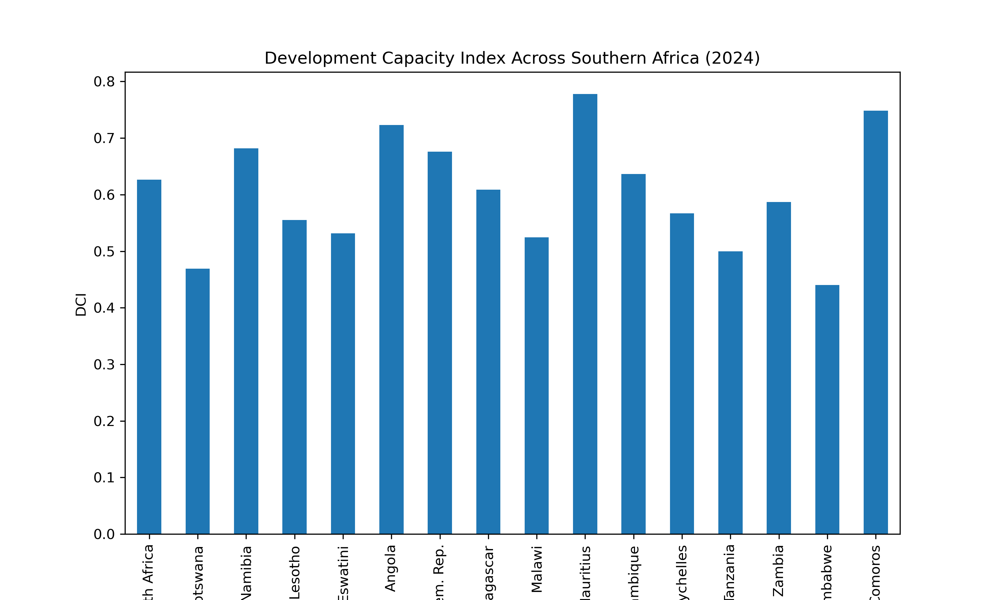

# southern-africa-development-analysis
Development Capacity Index, country ranking and economic stability analysis for Southern Africa (2000–2024)
# Southern Africa Development Analysis

This project analyzes development trends across Southern African countries from 2000–2024.

## Key Features

- Development Capacity Index (DCI)
- Country ranking analysis
- Economic stability / volatility analysis
- Data visualization

## Tools

Python  
Pandas  
NumPy  
Matplotlib  
Jupyter Notebook

## Project Structure

data/ → datasets  
notebooks/ → analysis notebook  
src/ → reusable functions  
figures/ → charts

## Example Visualization

